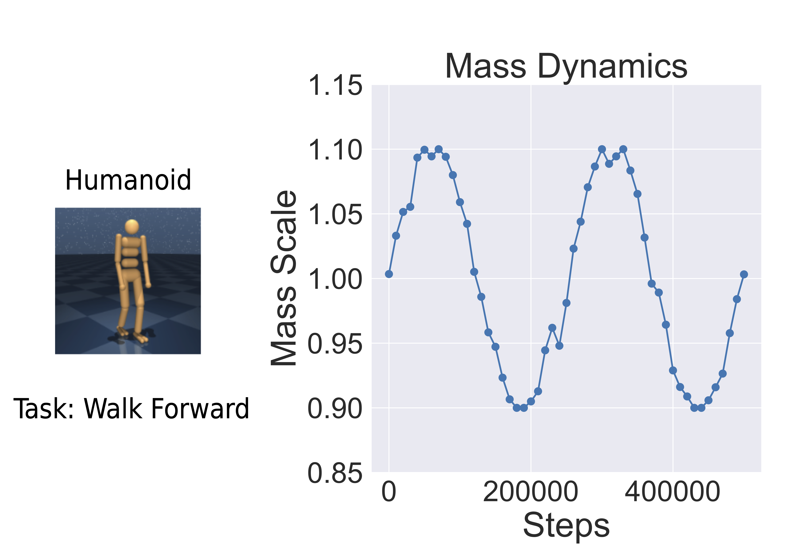

# Learning Successor Features across different timescales for continual non-stationary RL environments

This repository contains the official PyTorch implementation of the MuJoCo experiments from:

**Balancing Plasticity and Stability with Fast and Slow Successor Features**

which is accepted at ICML 2026.

The authors are Raymond Chua, Doina Precup and Blake Richards.

For the Jax implementation of the 3D Four Rooms experiments, check out [Multi-Timescales SFs Jax Implementation](https://github.com/raymondchua/multi-timescale-successor-features-fourrooms) 


[Paper](https://arxiv.org/abs/2605.26357)

[Blog post]

## Introduction

A major challenge in continual reinforcement learning is balancing:

- Plasticity: adapting to new environments
- Stability: retaining previously learned knowledge

We study this problem under continuous non-stationarity, where environment dynamics evolve gradually over time rather than changing abruptly.

Our approach combines:

- Successor Features (SFs) as predictive state representations
- Multi-timescale synaptic consolidation mechanisms

to obtain learning systems that can adapt rapidly while remaining robust to forgetting.

## Overview
The implemented models include the following models:
- TD3 (Fujimoto et al., 2018)
- TD3 with plasticity injection (Nikishin et al., 2023)
- TD3 with continual backprop (Dohare et al., 2024)
- TD3 with Elastic Weight Consolidation (Kirkpatrick et al., 2017)
- Multi-timescale synaptic consolidation on the parameters of Q-value (Kaplanis et al., 2018)
- SF Simple (Chua et al., 2024)
- Multi-timescale synaptic consolidation on the parameters of SFs (Our proposed model in the paper)

As described in the paper, we considered the following embodiments (listed in increasing order of complexity) to evaluate of the models across different levels of complexity, relating to dimensions of observation and action spaces.
- Cheetah
- Walker
- Quadruped
- Humanoid

## Quickstart Guide 
This section provides a step-by-step guide to getting started.

### 1. Setting Up the Environment
We recommend using **Conda** for dependency management. To set up the environment, run:
```bash
conda env create -f conda_env.yml
conda activate multitimescale_sfs_mujoco
```

### 2. Training Simple SFs
Once the environment is set up, start the training by running:
```bash
python full_train.py
```

### 3. Modifying Training Parameters
The configuration file full_train.yaml controls training parameters such as num_train_frames etc. 
To log and visualize training progress, set use_wandb to True. 

## Architecture

Overview of the proposed architecture, which integrates Simple Successor Features (SFs) with multi-timescale Synaptic Consolidation in an actor-critic framework for continuous control tasks.

<p align="center">
  
</p>

## Experimental Setup

To induce continual non-stationarity, we continuously modify embodiment mass throughout training.

Perturbations are generated using:

- Periodic noisy sinusoidal processes
- Non-periodic noisy sinusoidal processes
- Ornstein–Uhlenbeck processes

The resulting dynamics create smooth changes in transition dynamics while preserving task objectives.

The figure below illustrates an example perturbation trajectory for the Humanoid embodiment.

<p align="center">
  
</p>


Here are the results of the various embodiments:

<p align="center">
  
</p>

## Structure
***
The repository is structured as follows:
```plaintext
multi-timescale-successor-features-mujoco/
│── agent/                                                                  # Implementations of the various agents
│   ├── td3.py                                                              # Base TD3 agent for continuous actions, using actor-critic architecture.
│   ├── td3_beakers_params_continuous.py                                    # TD3 agent with synaptic consolidation on the parameters of the critic network.
│   ├── td3_beakers_params_continuous_capacitiy_scaled.py                   # Scaled variant of TD3 agent with synaptic consolidation on the parameters of the critic (Q-values).
│   ├── td3_capacity_scaled.py                                              # Scaled variant of TD3 agent.
│   ├── td3_cbp.py                                                          # TD3 agent with continual backprop.
│   ├── td3_cbp_capacity_scaled.py                                          # Scaled variant of TD3 agent with continual backprop.
│   ├── td3_online_ewc.py                                                   # TD3 agent with online variant of EWC.
│   ├── td3_online_ewc_capacity_scaled.py                                   # Scaled variant of TD3 agent with online variant of EWC.
│   ├── td3_plasticity_injection.py                                         # TD3 agent with plasticity injection on the critic network.
│   ├── td3_plasticity_injection_last_layer.py                              # TD3 agent with plasticity injection on the last layer of the critic network.
│   ├── td3_plasticity_injection_last_layer_capacity_scaled.py              # Scaled variant of TD3 agent with plasticity injection on the last layer of the critic network.
│   ├── ppo.py         # PPO agent
│   ├── sf_simple.py         # Simple SF agent.
│   ├── sf_online_ewc.py         # Simple SF agent with online variant of EWC.
│   ├── sf_simple_beakers_params_continuous.py                               # Simple SF agent with synaptic consolidation on the parameters of the SFs network.
│   ├── sf_simple_beakers_params_continuous_attention_diff_unique.py         # Simple SF agent with synaptic consolidation on the parameters of the SFs network, and cross-attention mechanism on the SFs operating across different timescales. In order to make the keys and values more discriminative, they are subtracted from its neighbour that learns at a faster timescale. 
│── custom_dmc_tasks/                                                         # Custom tasks and environments for the DeepMind Control Suite.
│   ├── cheetah.py                                                            # Default cheetah task for the DeepMind Control Suite.
│   ├── cheetahfast.py                                                        # Cheetah task with faster running speed.
│   ├── hopper.py                                                             # Default hopper task for the DeepMind Control Suite.
│   ├── humanoid.py                                                           # Default humanoid task for the DeepMind Control Suite.
│   ├── jaco.py                                                               # Default jaco task for the DeepMind Control Suite.
│   ├── quadrupled.py                                                         # Default quadrupled task for the DeepMind Control Suite.
│   ├── walker.py                                                             # Default walker task for the DeepMind Control Suite.
│── exp_local/                                                                # Log files for local experiments
│── full_train/                                                               # Saved buffers
│── img/                                                                      # Images for the README file
│── dmc.py                                                                    # wrapper for the DeepMind Control Suite
│── dmc_benchmarks.py                                                         # various benchmarks for the DeepMind Control Suite used in the paper
│── logger.py                                                                 # logger for the experiments
│── replay_buffer.py                                                          # replay buffer for the experiments
│── utils.py                                                                  # utility functions for the experiments
│── full_train_multitimescale.py                                              # for training the agents undergoing periodic changes
│── full_train_multitimescale_non_periodic.py                                 # for training the agents undergoing non-periodic changes
│── full_train_multitimescale_ou_drift.py                                     # for training the agents undergoing OU drifts
│── full_train_multitimescale_ppo.py                                          # for training ppo agents using parallel environments

```

## Acknowledgements
This repo is built upon the [simple SFs repo](https://github.com/raymondchua/simple_successor_features) 


## Citations
***
If you find this repository useful in your research, please consider citing our paper:
```bibtex
@article{chua2026balancing,
  title={Balancing Plasticity and Stability with Fast and Slow Successor Features},
  author={Chua, Raymond and Precup, Doina and Richards, Blake Aaron},
  year={2026}
}
```

